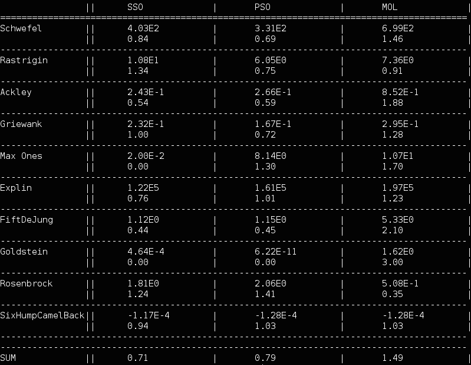

Sphere Swarm Optimization
========================

#### Particle swarm optimization variant in which particles move on the surface of an n-sphere instead of euclidean space



Included is a small framework for testing algorithms, with a few standard PSO optimizers, and a set of problems.

Screenshot is showing a comparison of my algorithm (SSO) with the standard particle swarm optimization (PSO) and a simplified PSO called Many Optimizing Liaisons (MOL). First row of every test function is showing average results of optimizers over 50 runs, and second one shows a relative score (from 0 to 3). Parameters of SSO and PSO were optimized with separate main class called ParameterOptimizer.

Graphic representation of algorithm can be enabled by setting ANIMATE flag to true.

How To Run
----------
```
$ git clone https://github.com/gto76/sphere-swarm-optimization
$ cd sphere-swarm-optimization
$ ./run
```
