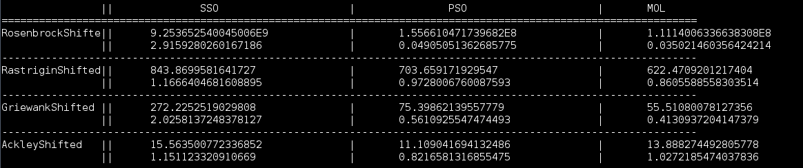

Sphere Swarm Optimization
========================

#### Particle swarm optimization variant in which particles move inside n-sphere instead of euclidean space



Included is a small framework for testing algorithms, with a few standard PSO optimizers, and a set of problems.

As seen on the screenshot my algorithm (SSO) doesn't compare well with the standard particle swarm algorithm (PSO) and a simplified PSO called Many Optimizing Liaisons (MOL). Still it is way cooler than both of them combined :)

How To Run
----------
```
$ git clone https://github.com/gto76/sphere-swarm-optimization
$ cd sphere-swarm-optimization
$ ./run
```
